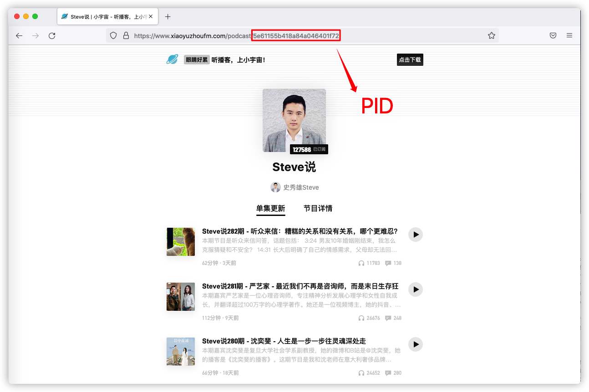

### 小宇宙FM获取播客节目数据

非常简单的一个 python 程序，只需要修改代码文件中第 8 行 `PID` 即可，请看下图示例。

能够获取到的数据有：
* `pid`：节目识别号
* `playCount`：播放量
* `duration`：节目时长
* `commentCount`：评论数
* `clapCount`：点赞数
* `favoriteCount`：标记喜欢
* `pubDate`：上传时间

**免责声明：**

1. 本文所提供的数据抓取程序代码及思路仅供学习、交流使用，不得用于其他用途；如因使用者恶意使用所产生的任何法律后果本作者均不负相应责任；
2. 如因数据接口存在变动、更新而导致所使用请求接口的代码失效或是程序无法正常运行，可能需要使用者自行修改相关程序，本作者不保证实时维护并修改代码，仅供学习参考。

